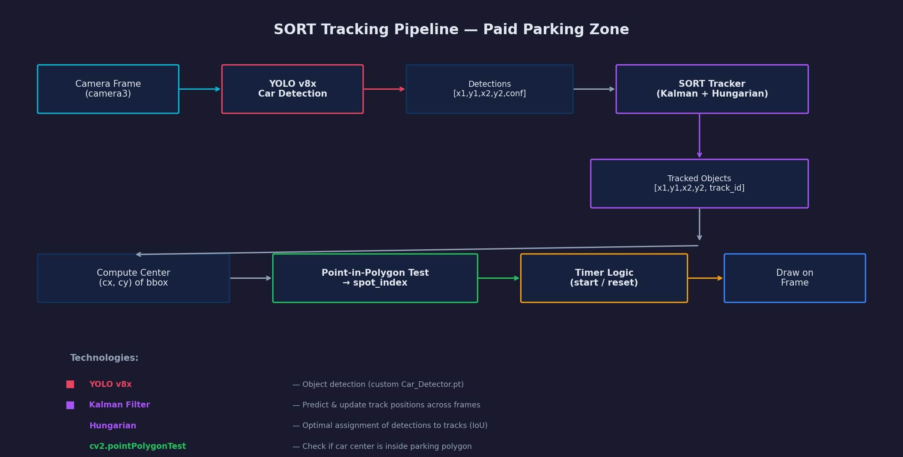
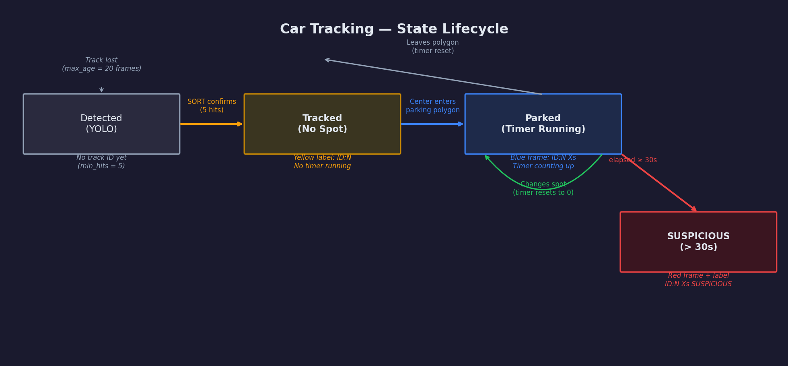

# Suspicious Parking Detection (SORT Tracking)

## Overview

The Suspicious Parking Detection system tracks individual cars in the **paid parking zone** (camera3) using the SORT algorithm. Each car receives a unique track ID that persists across frames. When a tracked car enters a parking spot and stays beyond a configurable time threshold (default: 30 seconds), it is flagged as **suspicious**.

This feature is only active for cameras listed in `TRACKING_CAMERA_IDS` — currently only `camera3` (the paid parking zone). Free parking cameras (camera1, camera2) do not use tracking.

---

## Technologies

### SORT (Simple Online and Realtime Tracking)

SORT is a lightweight multi-object tracking algorithm that combines two classical techniques:

1. **Kalman Filter** — predicts where each tracked object will be in the next frame based on its velocity and position history. This allows the tracker to maintain identity even when detection briefly fails (occlusion, missed frame).

2. **Hungarian Algorithm** — solves the assignment problem: given N existing tracks and M new detections, find the optimal one-to-one matching that minimizes total cost. The cost metric is **IoU (Intersection over Union)** — how much each predicted track bbox overlaps with each new detection bbox.

```
Frame N detections ─────────────┐
                                ↓
                    ┌───────────────────────┐
                    │   Kalman Filter        │
                    │   Predict positions    │
                    │   of existing tracks   │
                    └───────────┬───────────┘
                                ↓
                    ┌───────────────────────┐
                    │   Hungarian Algorithm  │
                    │   Match predictions    │
                    │   to new detections    │
                    │   (IoU cost matrix)    │
                    └───────────┬───────────┘
                                ↓
                    ┌───────────────────────┐
                    │   Update / Create /    │
                    │   Remove tracks        │
                    └───────────────────────┘
```

**Why SORT and not DeepSORT?** SORT is sufficient for this use case because:
- Cars in parking lots move slowly and predictably
- The camera is fixed with a stable viewpoint
- Cars don't frequently occlude each other in parking spots
- No re-identification across cameras is needed

DeepSORT adds a deep appearance model for re-identification, which adds latency without meaningful benefit in this scenario.

### Dependencies

| Library | Purpose |
|---------|---------|
| `filterpy` | Kalman filter implementation (`KalmanBoxTracker` class) |
| `scipy` | Hungarian algorithm via `linear_sum_assignment` |
| `numpy` | Matrix operations for IoU computation and bbox manipulation |

---

## Architecture

### Tracking Pipeline



*The full pipeline: camera3 frames pass through YOLO detection, then SORT tracking, then parking spot association and timer logic. The result is drawn directly onto the frame before WebSocket streaming.*

### Data Flow

```
┌──────────────┐     ┌─────────────┐     ┌──────────────────┐
│  Camera3     │     │  YOLO v8x   │     │  SORT Tracker    │
│  Frame       │────→│  detect_cars │────→│  .update(dets)   │
│  (from UE5)  │     │  → objects[] │     │  → tracks[]      │
└──────────────┘     └─────────────┘     └────────┬─────────┘
                                                   │
                         ┌─────────────────────────┘
                         ↓
              ┌────────────────────┐
              │  For each track:   │
              │  1. Compute center │
              │  2. Point-in-      │
              │     polygon test   │
              │  3. Timer logic    │
              │  4. Draw on frame  │
              └────────────────────┘
```

---

## Implementation

### Car State Lifecycle

Each tracked car goes through a state machine:



*A car progresses from initial YOLO detection → confirmed track → parked (timer starts) → suspicious (after 30s). Changing spots resets the timer. Leaving all spots stops the timer.*

**States:**

| State | Condition | Visual |
|-------|-----------|--------|
| Detected | YOLO sees a car, SORT not yet confirmed | No overlay |
| Tracked (no spot) | SORT confirmed (≥5 hits), car not in any polygon | Yellow label: `ID:N` |
| Parked (timer) | Car center inside a parking polygon | Blue frame + `ID:N Xs` |
| Suspicious | Parked for ≥ 30 seconds | Red frame + `ID:N Xs SUSPICIOUS` |

### Parking Spot Association

When a car is tracked, its bounding box center `(cx, cy)` is tested against every parking polygon for that camera using OpenCV's `cv2.pointPolygonTest()`:

```python
def _get_parking_spot_index(self, center, camera_id):
    polygons = self.camera_polygons.get(camera_id, [])
    for i, polygon in enumerate(polygons):
        polygon_array = np.array(polygon, np.int32).reshape((-1, 1, 2))
        if cv2.pointPolygonTest(polygon_array, center, False) >= 0:
            return i
    return -1  # not in any spot
```

If the center falls inside polygon `i`, the function returns `i` (the spot index). If the center is outside all polygons, it returns `-1`.

### Timer Logic

The tracking dictionary `track_times` stores `{track_id: (start_time, spot_index)}` for each parked car.

**Rules:**

1. **Car enters a spot for the first time** → record `(now, spot_index)`, timer starts from 0
2. **Car stays in the same spot** → timer continues counting from `start_time`
3. **Car changes to a different spot** → timer resets: `(now, new_spot_index)`
4. **Car leaves all spots** → entry removed from `track_times`, timer stops
5. **Car re-enters any spot** → treated as new entry, timer starts from 0

```python
if spot_index >= 0:
    if track_id in track_times:
        prev_time, prev_spot = track_times[track_id]
        if prev_spot != spot_index:
            # Changed spot — reset timer
            track_times[track_id] = (now, spot_index)
    else:
        # First time entering a spot
        track_times[track_id] = (now, spot_index)

    start_time, _ = track_times[track_id]
    elapsed = now - start_time
    is_suspicious = elapsed >= SUSPICIOUS_TIME_THRESHOLD
else:
    # Not in any spot — remove timer
    track_times.pop(track_id, None)
```

### Visual Feedback

| Element | Color | When |
|---------|-------|------|
| ID label (yellow) | `(255, 200, 0)` | Always, for every tracked car not in a spot |
| Bounding box frame | Blue `(255, 0, 0)` | Car is parked in a spot, timer < 30s |
| Bounding box frame | Red `(0, 0, 255)` | Car is parked in a spot, timer ≥ 30s |
| Text label | `ID:N Xs` | Parked car with elapsed time |
| Text label | `ID:N Xs SUSPICIOUS` | Parked car exceeding threshold |

The label is positioned below the bounding box (`y2 + 20`), or above it if the bottom is near the frame edge.

### Stale Track Cleanup

After processing all active tracks, any `track_id` in `track_times` that is no longer in the current frame's tracks is removed:

```python
stale_ids = [tid for tid in track_times if tid not in active_ids]
for tid in stale_ids:
    del track_times[tid]
```

This prevents memory leaks when cars leave the camera view.

---

## Configuration

All parameters are class constants in `ParkingDetector` (`web_app/detector.py`):

| Parameter | Default | Description |
|-----------|---------|-------------|
| `TRACKING_CAMERA_IDS` | `["camera3"]` | Which cameras use SORT tracking |
| `SORT_MAX_AGE` | `20` | Frames to keep a track alive without new detections |
| `SORT_MIN_HITS` | `5` | Minimum consecutive detections before a track is confirmed |
| `SORT_IOU_THRESHOLD` | `0.3` | Minimum IoU to match a detection to an existing track |
| `SUSPICIOUS_TIME_THRESHOLD` | `30` | Seconds before a parked car is flagged suspicious |

### Tuning Guide

**`SORT_MAX_AGE`** — Higher values keep tracks alive longer during occlusion, but may produce ghost tracks. Lower values lose tracks faster when detection drops a frame.

**`SORT_MIN_HITS`** — Higher values prevent flickering short-lived tracks but delay when the ID first appears. 5 frames at ~10 FPS means ~0.5s delay.

**`SORT_IOU_THRESHOLD`** — Lower values allow more permissive matching (good for slow-moving cars). Higher values require closer overlap, reducing ID switches but increasing track fragmentation.

**`SUSPICIOUS_TIME_THRESHOLD`** — Depends on paid parking rules. 30 seconds is a demo value; in production this would typically be 5–15 minutes.

---

## Integration with the Web App

### Backend

The `process_frame()` method calls `_update_tracking()` only for cameras in `TRACKING_CAMERA_IDS`:

```python
tracked_count, suspicious_count = 0, 0
if camera_id in self.TRACKING_CAMERA_IDS:
    tracked_count, suspicious_count = self._update_tracking(img, object_list, camera_id)
```

The `suspicious_count` is included in the stats dictionary sent over WebSocket to the browser.

### Frontend

The dashboard shows the suspicious count in two places:

1. **Paid Parking view** — a dedicated "Suspicious" stat card with a clock icon, purple-colored
2. **Overview** — the paid zone summary card includes the suspicious count
3. **Navigation badge** — the "Paid Parking" tab badge shows available spots (not suspicious count)

The suspicious count is only displayed when the Parking Spaces mode is active (it depends on polygon data to determine spot occupancy).

---

## Files

| File | Purpose |
|------|---------|
| `web_app/detector.py` | `_update_tracking()`, `_get_parking_spot_index()`, `_draw_track_info()`, `_draw_track_id()` — all tracking logic |
| `neosmart/tracking/sort.py` | SORT algorithm implementation: `Sort`, `KalmanBoxTracker`, `associate_detections_to_trackers` |
| `CarParkingSpace/camera3_parkings.p` | Parking polygons for camera3 (used for spot association) |
| `web_app/static/js/app.js` | Frontend: displays `suspicious_count` in the paid zone stats panel |
| `web_app/templates/index.html` | HTML structure for the suspicious stat card |
| `legacy/suspicious_car_detector.py` | Standalone prototype script (basis for the integrated implementation) |

---

## Standalone Prototype

The original standalone script (`SmartParking/legacy/suspicious_car_detector.py`) was the basis for the integrated implementation. It captures video from a connected camera, runs YOLO + SORT, and displays elapsed time for each tracked car. See [LEGACY_TOOLS.md](LEGACY_TOOLS.md) for context.

```bash
python SmartParking/legacy/suspicious_car_detector.py
```

Key differences from the integrated version:
- Uses a live camera (`cv2.VideoCapture`) instead of UE5 frames
- No parking polygon association — timer starts immediately on track creation
- No web dashboard — displays in a local OpenCV window
- No concept of "suspicious" — just shows elapsed time in blue/red

---

## Troubleshooting

**Track IDs jump or reset frequently:**
- Increase `SORT_MAX_AGE` to keep tracks alive longer between detections
- Lower `SORT_IOU_THRESHOLD` to allow more flexible matching
- Check that YOLO confidence (`0.8`) isn't filtering out valid detections

**Cars are never flagged as suspicious:**
- Verify that `camera3_parkings.p` exists and contains correct polygons
- Check that the car's center actually falls inside a polygon (use `mark_parking_spaces.py` to verify polygon placement)
- Lower `SUSPICIOUS_TIME_THRESHOLD` for testing

**Timer doesn't reset when car changes spots:**
- This indicates the car center isn't leaving one polygon and entering another. The polygons may overlap or have gaps — re-mark them with `mark_parking_spaces.py`

**`ModuleNotFoundError: No module named 'filterpy'`:**
- Install the dependency: `pip install filterpy`
- Or install all requirements: `pip install -r SmartParking/requirements.txt`
