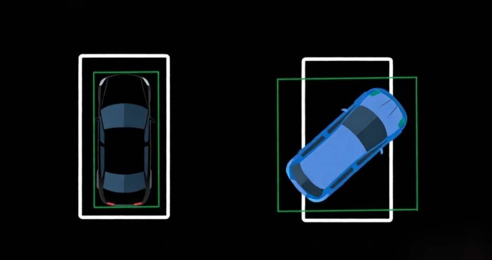
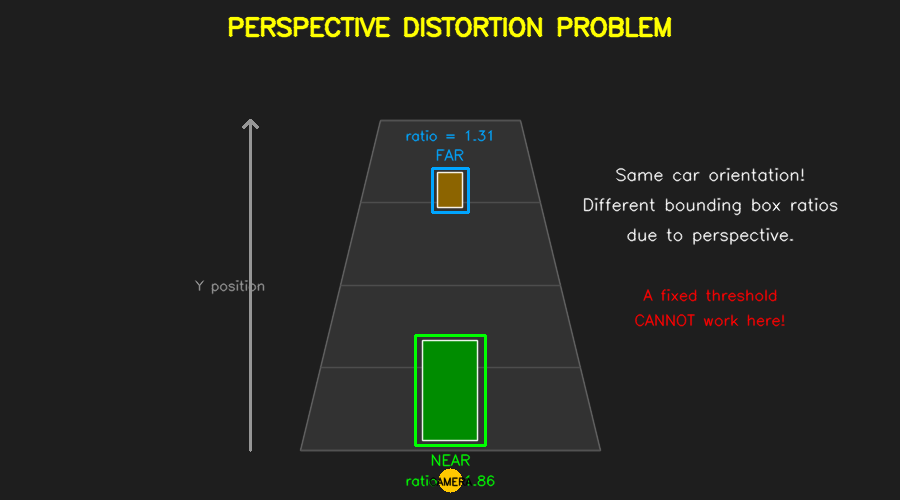
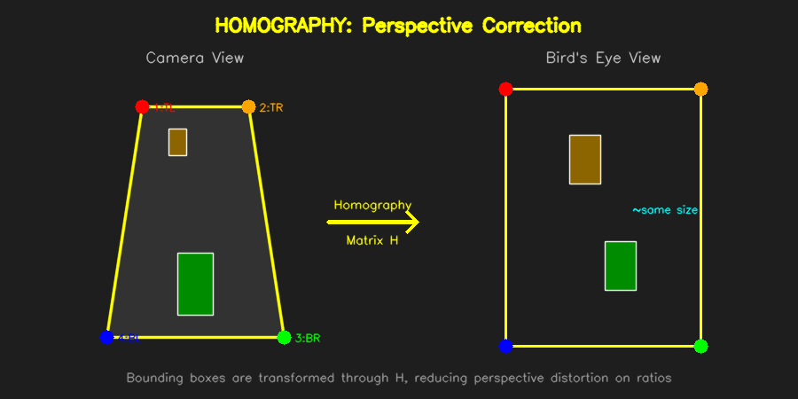
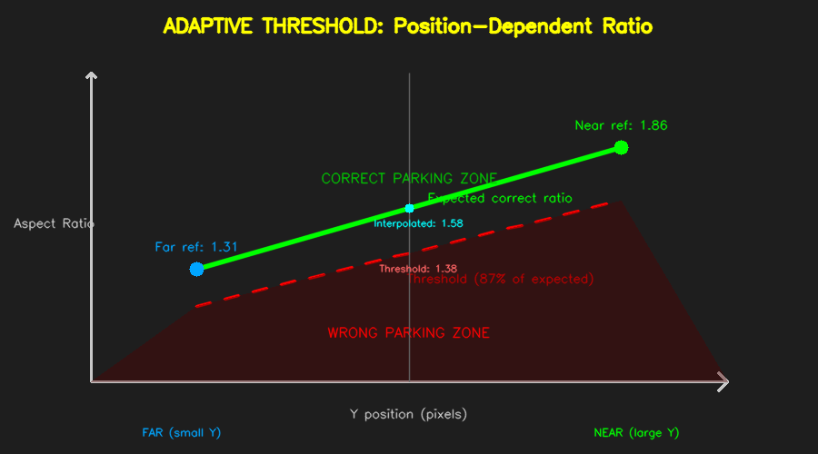
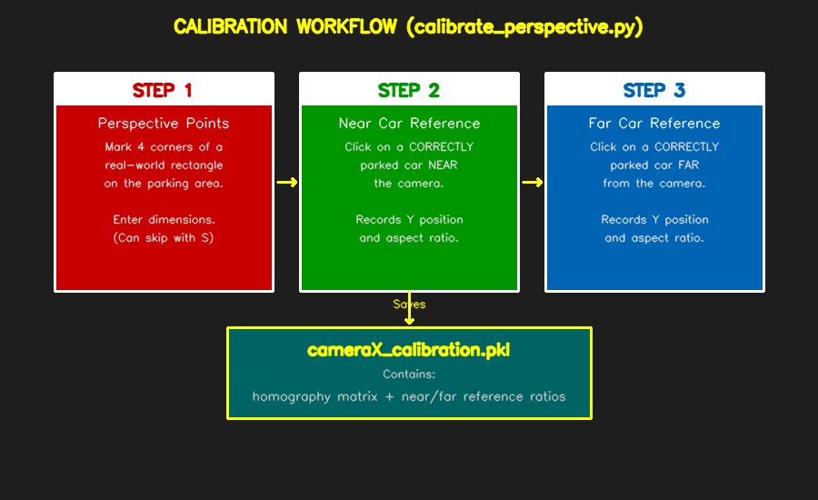
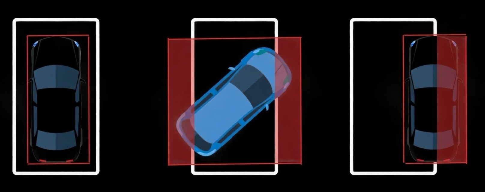

# Wrong Parking Detection

## Overview

The Wrong Parking Detection system identifies cars that are not properly aligned with their parking space. Two approaches are implemented:

1. **Advanced (ROI-based)** — integrated into the main web application. Compares the car's bounding box against its parking space polygon to measure how much of the car extends outside the slot. This is the **primary method** used in production.

2. **Basic (Aspect Ratio)** — a standalone script. Analyzes the bounding box aspect ratio with adaptive thresholds and optional homography correction. Useful for scenes without pre-marked parking polygons.

---

## Advanced Detection (ROI-based) — Web App

### Core Idea: Polygon Overlap

Each parking space is defined as a polygon (marked via `mark_parking_spaces.py`). When YOLO detects a car, the system finds which polygon contains the car's center point. It then calculates what **percentage of the car's bounding box area falls outside** that polygon. If the percentage exceeds a threshold, the car is classified as wrongly parked.


*A wrongly parked car: 44% of its bounding box (red rectangle) extends outside the assigned parking polygon (red-shaded area). Free spots are green.*

### Why This Works

A correctly parked car fits neatly inside its parking space polygon — the bounding box and polygon overlap almost entirely, so the outside percentage is low (typically 5–20%). A car parked at an angle, too far forward, or diagonally will stick out significantly, producing a high outside percentage (40%+).

### Adaptive Thresholds (Fish-Eye Correction)

Camera lenses introduce distortion, especially at the edges of the frame. Bounding boxes near frame edges appear stretched, which inflates the outside percentage even for correctly parked cars. To compensate, the system uses **per-polygon thresholds** based on position:

| Camera | Polygon position | Threshold |
|--------|-----------------|-----------|
| camera1 | Rightmost 2 (indices 0, 1) | 52% (per-index override) |
| camera1 | Edge spots (indices 0, 1, n-2, n-1) | 45% |
| camera1 | Middle spots | 25% |
| camera2 | All except last 2 | 31% (per-camera override) |
| camera2 | Last 2 (far edge) | 45% |
| camera3 | Edge spots (indices 0, 1, n-2, n-1) | 45% |
| camera3 | Middle spots | 25% |

The threshold priority chain is: **per-index override > edge threshold > per-camera default > global default**. Edge polygons get a higher threshold (45%) because fish-eye distortion makes bounding boxes extend further outside the polygon even when parking is correct.

These thresholds are configured in `web_app/detector.py`:

```python
OUTSIDE_THRESHOLD_DEFAULT = 25   # Central spots (global default)
OUTSIDE_THRESHOLD_EDGE = 45      # Edge spots (fish-eye distortion)

OUTSIDE_THRESHOLD_PER_CAMERA = {
    "camera2": 31,               # Per-camera default override
}

EDGE_INDICES = {
    "camera1": lambda n: {0, 1, n - 2, n - 1},  # Left 2 + right 2
    "camera2": lambda n: {n - 2, n - 1},          # Last 2 (far edge)
    "camera3": lambda n: {0, 1, n - 2, n - 1},   # All 4 edges
}

OUTSIDE_THRESHOLD_OVERRIDES = {
    "camera1": lambda n: {0: 52, 1: 52},  # Rightmost 2 spots
}
```

### Integration with the Web App

The advanced detection is built into the **Parking Spaces** mode of the web dashboard. It runs automatically alongside the standard occupancy detection — no separate mode selection needed.

What you see in the browser:

- **Green polygon** — free parking space
- **Red polygon** — occupied parking space (car detected inside)
- **Green bounding box** — correctly parked car (bbox fits within polygon)
- **Red bounding box + "Wrong (X%)" label** — wrongly parked car (bbox extends >threshold outside polygon)
- **Wrong counter** — shown per camera and in the aggregate statistics panel

### Running

```bash
cd SmartParking/web_app
python main.py
```

Open http://localhost:8000. The wrong parking detection is active whenever the mode is set to "Parking Spaces" (the default).

### Algorithm

```
For each parking polygon:
    1. Find the car whose center is inside this polygon
    2. If no car → mark polygon green (free)
    3. If car found → mark polygon red (occupied)
    4. Create binary masks for the polygon and the car's bounding box
    5. Compute intersection area (bitwise AND of both masks)
    6. outside_percentage = (car_area - intersection_area) / car_area * 100
    7. Look up threshold for this camera + polygon index
    8. If outside_percentage > threshold → WRONG parking
       Draw red bounding box + "Wrong (X%)" label
```

### Standalone Testing Script

A standalone version is also available for testing outside the web app:

```bash
cd SmartParking/WrongParking
python wrong_parking_advanced.py
```

This captures the UE5 window directly and displays the same ROI-based detection in an OpenCV window.

---

## Basic Detection (Aspect Ratio) — Standalone

### How It Works

### Core Idea: Aspect Ratio

When a car is parked correctly (aligned with the space), its bounding box is a tall, narrow rectangle. When a car is parked at an angle, its bounding box becomes more square-shaped.



*Left: Correctly parked car — tall bounding box (high aspect ratio). Right: Wrongly parked car — more square bounding box (low aspect ratio).*

The **aspect ratio** is computed as:

```
ratio = max(height, width) / min(height, width)
```

Using `max/min` instead of just `height/width` makes it independent of camera rotation — a car viewed from the side or from the front both produce high ratios when correctly parked.

### The Problem: Perspective Distortion

A single fixed threshold doesn't work because perspective distortion causes the aspect ratio to vary with position:



Cars **near** the camera have taller bounding boxes (ratio ~1.86), while cars **far** from the camera have squarer bounding boxes (ratio ~1.31) — even though both are correctly parked. A fixed threshold would either miss wrong parking near the camera or produce false positives far from it.

### Solution: Two-Part Calibration

The system uses two techniques to handle this:

#### 1. Homography (Perspective Correction)

A homography matrix transforms bounding box corners from the distorted camera view into a bird's-eye view, partially correcting for perspective:



This reduces the ratio variation but doesn't eliminate it completely (because the bounding box is a 2D projection of a 3D car, not a ground-plane feature).

#### 2. Adaptive Threshold (Position-Dependent)

Two reference points are calibrated — a correctly-parked car **near** the camera and one **far** from the camera. For any car at an intermediate Y position, the expected "correct" ratio is linearly interpolated between the two reference values. The threshold is then set at a configurable percentage (default: 87%) of this expected ratio:



```
threshold(Y) = interpolated_correct_ratio(Y) * THRESHOLD_FACTOR
```

If a car's actual ratio falls below this threshold, it is classified as **wrongly parked**.

---

## Files

| File | Purpose |
|------|---------|
| `web_app/detector.py` | **Advanced detection** — integrated into `ParkingDetector.overlay_parking_spaces()` |
| `WrongParking/wrong_parking_advanced.py` | Standalone advanced detection (captures UE5 window) |
| `WrongParking/wrong_parking_basic.py` | Standalone basic detection (aspect ratio + calibration) |
| `WrongParking/calibrate_perspective.py` | Calibration tool for the basic detector (reads from `frames/`) |
| `WrongParking/camera1_calibration.pkl` | Calibration data for camera 1 (basic detector) |
| `WrongParking/camera2_calibration.pkl` | Calibration data for camera 2 (basic detector) |
| `CarParkingSpace/camera1_parkings.p` | Parking polygons for camera 1 (used by advanced detector) |
| `CarParkingSpace/camera2_parkings.p` | Parking polygons for camera 2 (used by advanced detector) |

---

## Calibration (calibrate_perspective.py) — Basic Detector

The calibration tool is a 3-step wizard that creates a single `.pkl` file per camera. It reads frames from the `frames/` directory (no live UE5 capture needed).



### Running the Calibration

```bash
cd SmartParking/WrongParking
python calibrate_perspective.py
```

On launch, you'll be asked which camera to calibrate (1 or 2).

### Step 1: Perspective Points (Homography)

Mark 4 corners of a rectangle that you know is rectangular in the real world (e.g., the outline of a parking space or a group of spaces):

1. Click 4 points: **Top-Left**, **Top-Right**, **Bottom-Right**, **Bottom-Left**
2. Press **S** to confirm
3. Enter the real-world width and height of that rectangle (any unit — meters, parking widths, etc.)
4. A bird's-eye preview will appear to verify the transform

If you want to **skip** homography, press **S** with 0 points marked.

| Control | Action |
|---------|--------|
| Left click | Place a point |
| Right click | Remove last point |
| Z | Clear all points / go back one step |
| S / Enter | Confirm and proceed |
| Q | Quit |

### Step 2: Near Car Reference

**Mark 4 corners** (TL → TR → BR → BL) of a CORRECTLY parked car that is **NEAR the camera** (close to the bottom of the frame). Press **S** to confirm. The system computes the bounding box, Y position, and aspect ratio.

### Step 3: Far Car Reference

**Mark 4 corners** of a CORRECTLY parked car that is **FAR from the camera** (close to the top of the frame). Press **S** to confirm.

The tool automatically swaps near/far if needed based on Y coordinates.

### Output

The calibration is saved to `camera1_calibration.pkl` or `camera2_calibration.pkl` containing:

```python
{
    "camera_id": "camera1",          # Which camera
    "homography": np.array(...),     # 3x3 matrix (or None if skipped)
    "perspective_points": [...],     # The 4 perspective points
    "near_y": 450,                   # Y position of near reference car
    "near_ratio": 1.86,             # Aspect ratio of near reference car
    "far_y": 180,                    # Y position of far reference car
    "far_ratio": 1.31,             # Aspect ratio of far reference car
    "near_car_points": [...],       # 4 corners marked for near car
    "far_car_points": [...],        # 4 corners marked for far car
    "image_size": (1280, 720),      # Frame dimensions
}
```

---

## Basic Detection Script (wrong_parking_basic.py)

The detection script captures the UE5 window in real time, detects cars with YOLO, and classifies each as correctly or wrongly parked.

### Running Detection

```bash
cd SmartParking/WrongParking
python wrong_parking_basic.py
```

On launch, you'll be asked which camera to use (1 or 2). The script loads the corresponding `camera{N}_calibration.pkl` file.

### What It Shows

Each detected car displays:
- **"Correct"** (green) or **"Wrong"** (red) label
- The actual ratio and threshold in parentheses: `Correct (1.82/1.56)` means ratio=1.82, threshold=1.56

The top bar shows: `camera1 | Cars: 5 | Wrong: 1 | adaptive`

### Wrong Parking Examples



*Red bounding boxes and labels indicate wrongly parked cars. Cars parked at an angle, diagonally, or sideways all produce lower aspect ratios.*

| Control | Action |
|---------|--------|
| Q / Close window | Quit |

### Configuration

The `THRESHOLD_FACTOR` constant (default `0.87`) controls sensitivity:

- **Higher value** (e.g. 0.92): More strict — more cars flagged as wrong
- **Lower value** (e.g. 0.80): More lenient — only severely angled cars flagged

If no calibration file exists, a fixed threshold of 1.4 is used (less accurate).

---

## Basic Algorithm Details

### Ratio Computation

```python
def compute_ratio(x, y, w, h, H=None):
    if H is not None:
        # Transform bbox corners through homography
        corners = [[x,y], [x+w,y], [x+w,y+h], [x,y+h]]
        transformed = cv2.perspectiveTransform(corners, H)
        # Compute width and height in transformed space
        t_w = average of top and bottom edge lengths
        t_h = average of left and right edge lengths
        ratio = max(t_w, t_h) / min(t_w, t_h)
    else:
        ratio = max(h, w) / min(h, w)
    return ratio
```

### Adaptive Threshold

```python
def get_adaptive_threshold(y_center, calib):
    # Linear interpolation between near and far reference points
    t = (y_center - near_y) / (far_y - near_y)
    t = clamp(t, -0.2, 1.2)  # slight extrapolation allowed

    expected_ratio = near_ratio + t * (far_ratio - near_ratio)
    threshold = expected_ratio * THRESHOLD_FACTOR

    return threshold
```

### Decision

```
if car_ratio < threshold:
    → WRONG parking
else:
    → CORRECT parking
```

---

## Troubleshooting

**All cars show "Wrong":**
- Re-run calibration. Make sure you click on CORRECTLY parked cars in steps 2-3.
- Try increasing `THRESHOLD_FACTOR` (make it more lenient).

**No cars are flagged as "Wrong":**
- Decrease `THRESHOLD_FACTOR` to be more strict.
- Verify the calibration file matches the current camera angle.

**Calibration tool hangs after pressing S:**
- After marking 4 points and pressing S, the script waits for console input (real-world dimensions). Switch to the terminal window and enter the values.

**"No calibration found" warning:**
- Run `calibrate_perspective.py` first for the selected camera.

**Detection window doesn't capture UE5:**
- Make sure UE5 is running and the viewport is visible (not minimized).
- The script looks for windows with "Unreal Editor", "UE5", or "UnrealEditor" in the title.
