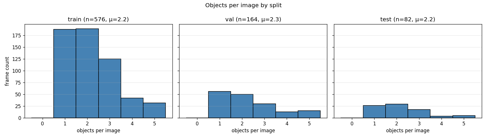
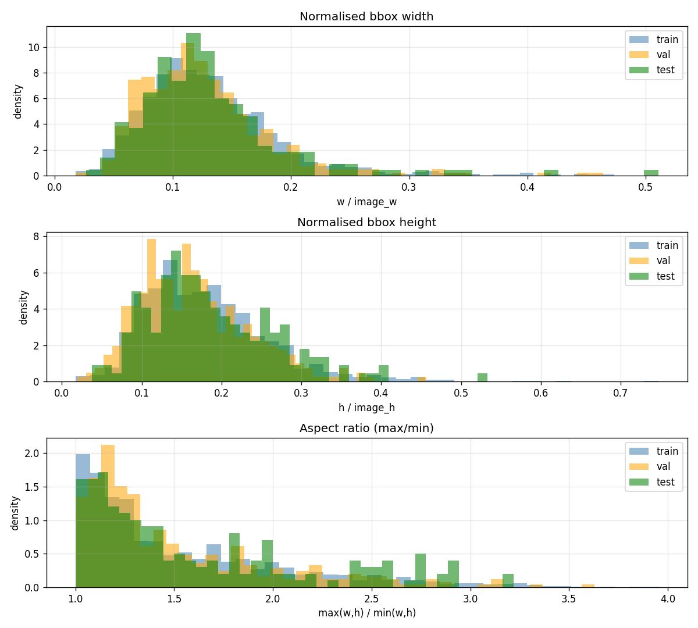
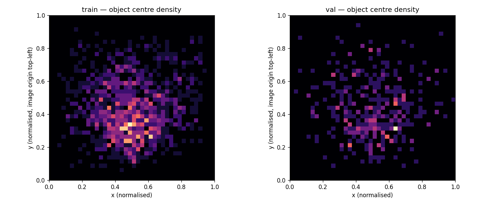
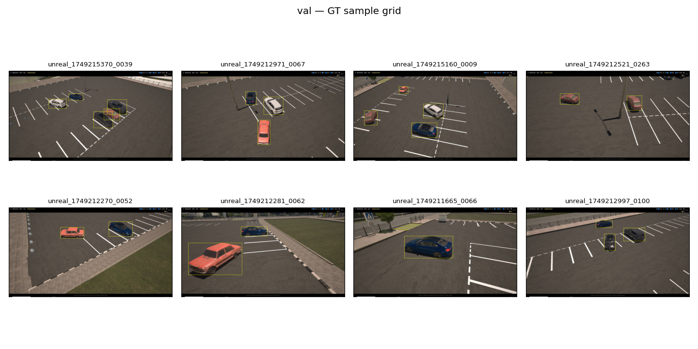

# NeoSmart — CarDetector EDA report

_Auto-generated by [notebooks/01_eda.py](../../notebooks/01_eda.py). Do not edit by hand — rerun the script to refresh._

## Dataset

- Source: `Training/data/data.yaml`
- Origin: UE5-rendered synthetic frames (`unreal_*.jpg`), no real footage.
- Classes: `['car']` (nc=1)
- Total: 822 images, 1821 annotated objects.

## Split sizes

| split | images | objects | empty frames | µ obj/frame |
|-------|--------|---------|--------------|-------------|
| train | 576 | 1269 | 0 | 2.2 |
| val | 164 | 373 | 0 | 2.3 |
| test | 82 | 179 | 0 | 2.2 |

## Objects per image

## Bounding-box geometry

- **train** — w: µ=0.131 σ=0.059, h: µ=0.181 σ=0.079, aspect µ=1.55 (p95=2.67)
- **val** — w: µ=0.126 σ=0.057, h: µ=0.165 σ=0.069, aspect µ=1.50 (p95=2.53)
- **test** — w: µ=0.132 σ=0.064, h: µ=0.187 σ=0.080, aspect µ=1.60 (p95=2.76)

## Spatial heatmap (object centres)

## Train/val drift — KS test
| dimension | D | p-value |
|-----------|---|---------|
| bbox width | 0.069 | 0.12 |
| bbox height | 0.106 | 0.00264 |
| aspect ratio | 0.065 | 0.167 |
| objects per image | 0.042 | 0.968 |

## Validation sample grid (ground truth)

