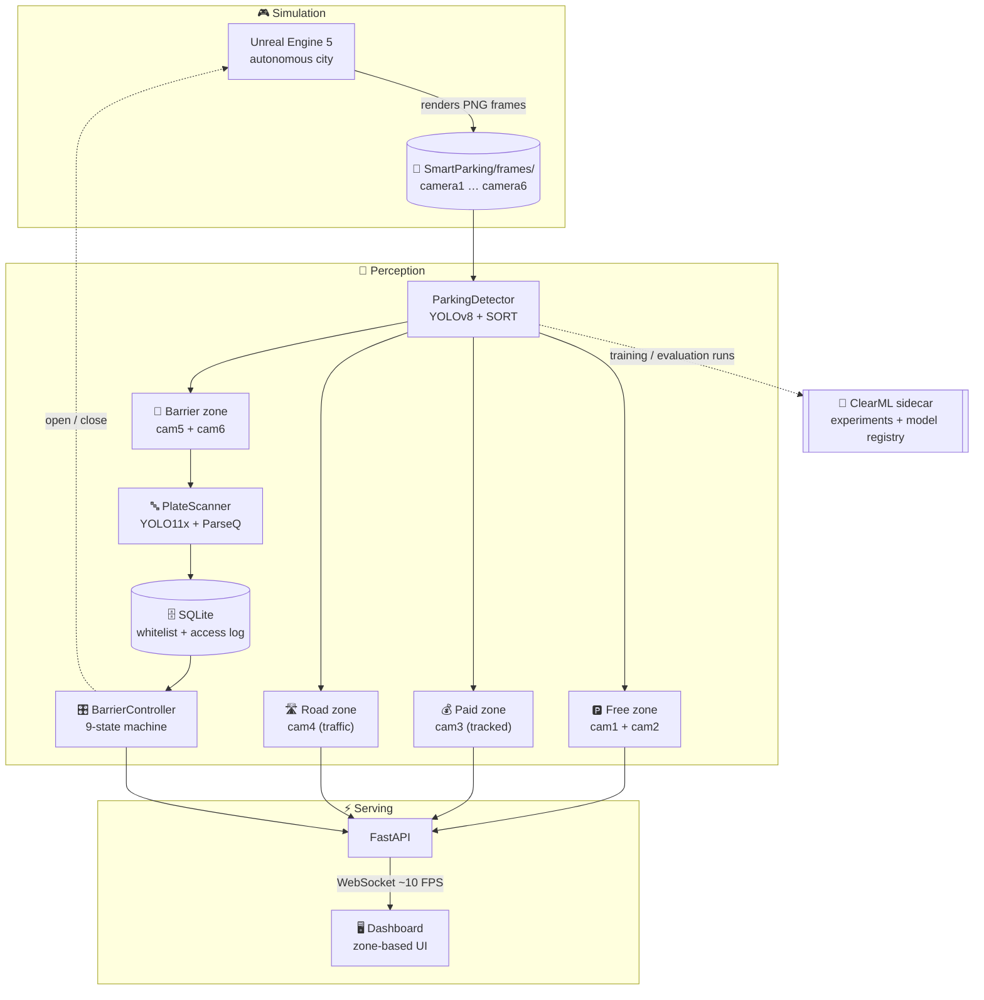
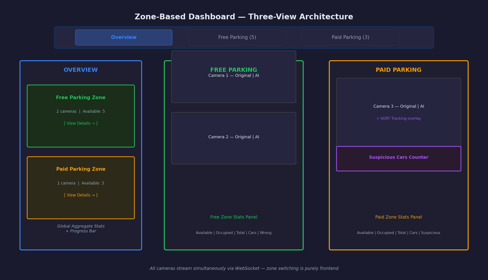
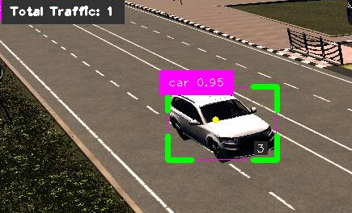
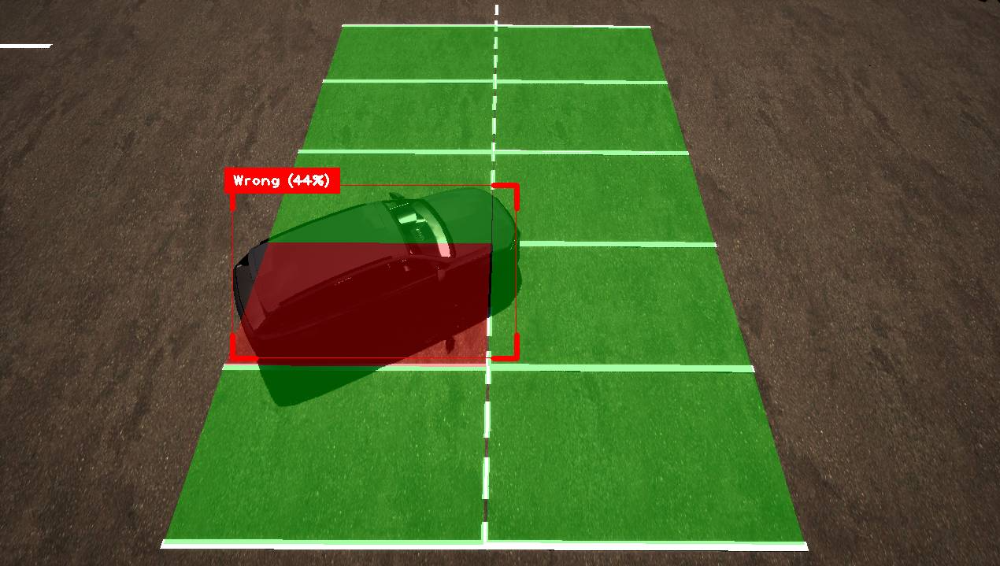
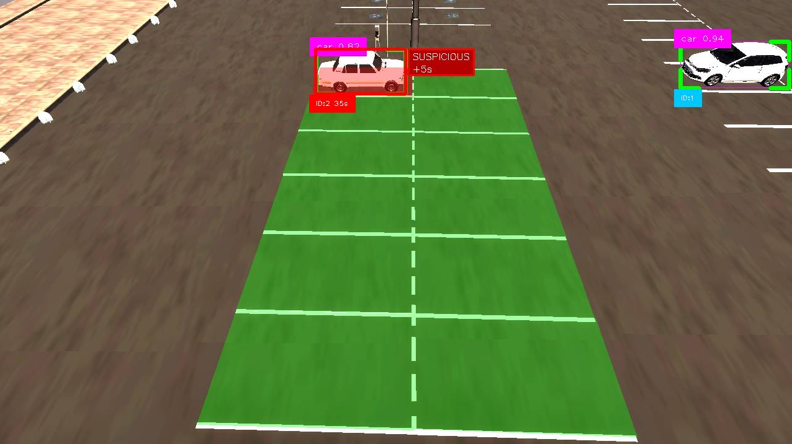
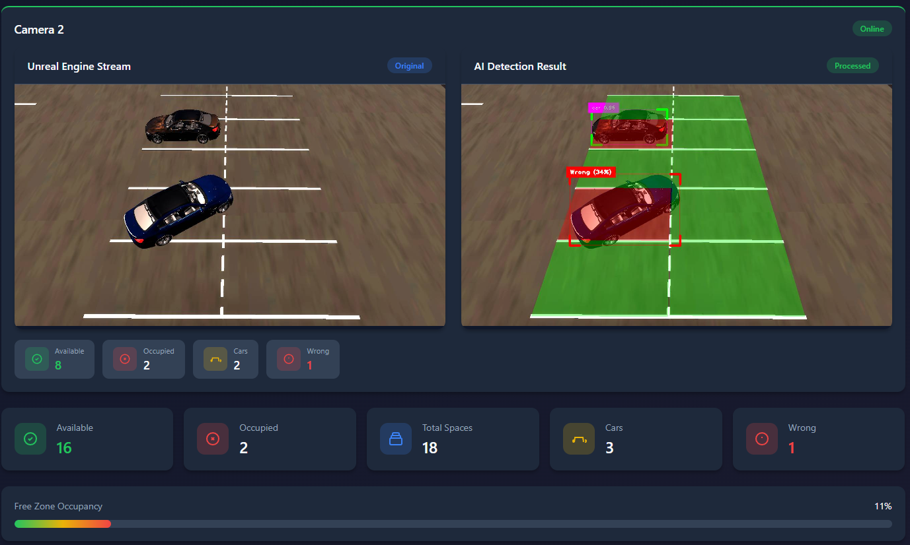
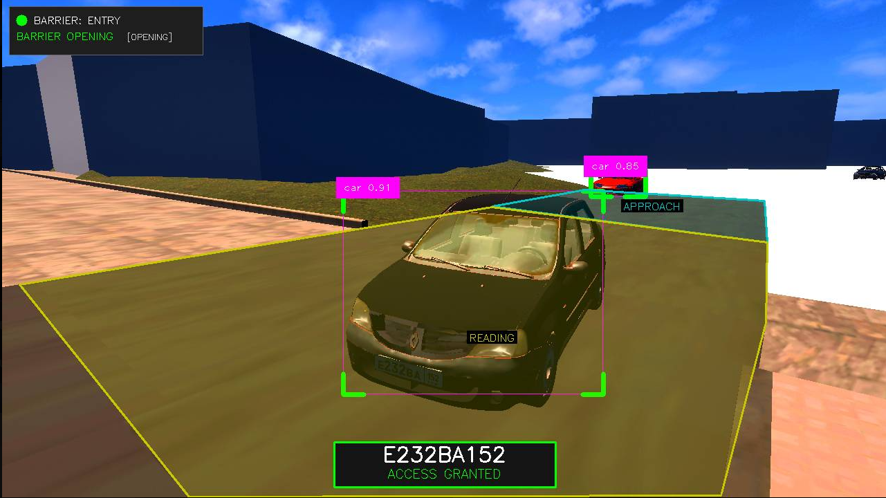
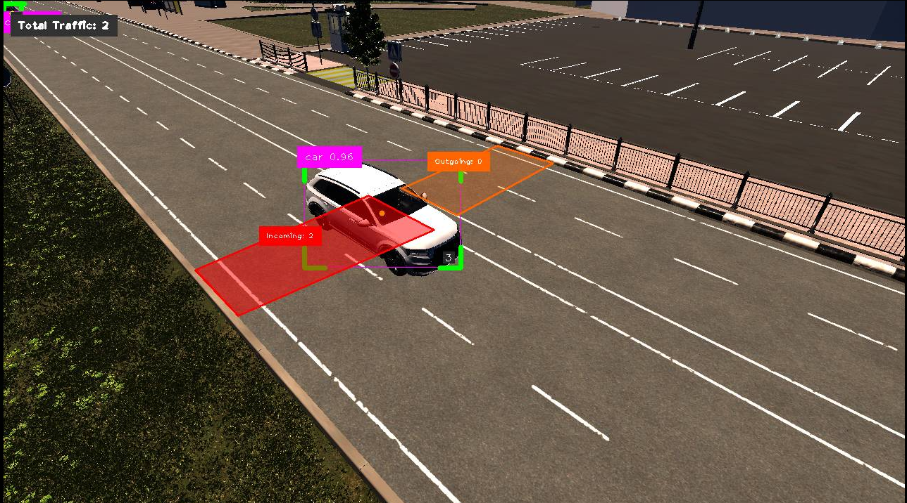

<div align="center">

<h1>
  <br>
  🅽🅴🅾🆂🅼🅰🆁🆃
  <br>
</h1>

<h3>Smart Parking & Access Control for the city of Nizhny Novgorod</h3>

<p><i>An end-to-end computer-vision pipeline that watches an autonomous UE5 city<br>and turns six synthetic camera feeds into live parking intelligence.</i></p>

<p>
  
  
  
  
  
</p>

<p>
  
  
  
  
  
  
</p>

<p>
  <a href="#quickstart">Quickstart</a> •
  <a href="#architecture">Architecture</a> •
  <a href="#features">Features</a> •
  <a href="#tech-stack">Tech Stack</a> •
  <a href="#quality-mlops">Quality &amp; MLOps</a> •
  <a href="#documentation">Documentation</a>
</p>

</div>

---

## 🚀 TL;DR

NeoSmart is a **real-time parking-lot intelligence system** built around a YOLO car detector, SORT multi-object tracker, a license-plate recognition barrier (PlateScanner), and a FastAPI dashboard that streams processed frames over WebSocket at ~10 FPS.

The parking lot lives inside an **autonomous Unreal Engine 5 city** that renders traffic, cars, and pedestrians. Six virtual cameras dump frames into `SmartParking/frames/`, and the web app picks them up, runs inference, and drives the barrier - closing the loop back into UE5 over a REST handshake.

> **Why synthetic data?** The entire pipeline is validated on UE5-rendered frames by design: it lets us demonstrate the full MLOps stack (data -> training -> evaluation -> serving -> observability) reproducibly, without privacy or licensing friction. The pipeline is **ready to ingest real camera streams the moment they become available** - the same YOLO + SORT + barrier stack simply swaps its input source.

---

<a id="architecture"></a>
## 🧭 System Architecture



The web app is **platform-agnostic and Dockerised**. UE5 runs on the host (Windows), writes frames into a bind-mounted directory, and the container serves the dashboard - no direct window capture, no `win32gui` in the hot path.

<div align="center">
  
  <br><sub><i>Overview, free-zone and paid-zone dashboard views - one camera per tile, aggregated stats per zone.</i></sub>
</div>

---

<a id="features"></a>
## ✨ Features

The dashboard exposes six independent computer-vision modules, each bound to a specific camera (or pair of cameras) and zone.

### 🚗 Car Detection & Multi-Object Tracking

<div align="center">
  
</div>

A custom YOLOv8 detector (`Models/Car_Detector.pt`, trained on the UE5 dataset) produces bounding boxes for every frame. For cameras in `TRACKING_CAMERA_IDS`, a **SORT tracker** (Kalman filter + IoU-based Hungarian assignment) maintains persistent IDs across frames - the foundation for everything that needs temporal reasoning: suspicious parking, traffic counting, and the barrier state machine.

### 📐 Wrong Parking Position

<div align="center">
  
</div>

Each parking spot is marked as a polygon ([CarParkingSpace/mark_parking_spaces.py](SmartParking/CarParkingSpace/mark_parking_spaces.py)). For every detection that overlaps a spot, we compute the **fraction of the car's bounding box lying outside the polygon**. Above a per-camera, per-spot configurable threshold (to compensate for fisheye distortion at frame edges), the car is flagged as **improperly parked** - overlay turns red.

### ⏱️ Suspicious Car Detector

<div align="center">
  
</div>

In the paid zone, every tracked car carries a **per-spot dwell timer**. Cars staying longer than `SUSPICIOUS_TIME_THRESHOLD` (30 s by default, configurable) are flagged as **suspicious** - bounding box flips red, label changes to `SUSPICIOUS`. The timer resets if the car moves to a different spot, so lane-switching doesn't trigger false positives.

### 🅿️ Free Parking Space Counting

<div align="center">
  
</div>

Per-camera **occupancy computation**: polygons are tested against all detections on the frame; each polygon is flagged as free or occupied, and aggregated counts ("free spaces / total spaces") are published per zone. Cameras 1 and 2 watch the same area from different angles - the aggregator **deduplicates on camera 1 only** to avoid double-counting.

### 🚧 Smart Barrier - License Plate Access Control

<div align="center">
  
</div>

The entry barrier is a **9-state machine** (`IDLE → CAR_APPROACHING → READING_PLATE → ACCESS_GRANTED/DENIED → BARRIER_OPENING → CAR_PASSING → BARRIER_CLOSING → IDLE`) running across two cameras:

- **Camera 5** watches the approach + reading zones. While a car sits in the reading zone, **OCR runs every frame** until `PLATE_MIN_AGREEING_READS` consecutive readings agree (or the car leaves, in which case the best accumulated reading is used).
- **Camera 6** watches the safety zone past the barrier. During `CAR_PASSING`, the barrier **refuses to close while a car is present** - with a 3-second grace window to avoid premature closes right after opening.

Recognised plates are checked against the `allowed_plates` SQLite whitelist, access is logged, parking sessions are opened/closed with duration, and UE5 receives `"open"` / `"close"` commands over a REST handshake.

### 🛣️ Traffic Counter

<div align="center">
  
</div>

Camera 4 watches the road connecting the free and paid zones. Two **virtual crossing lines** detect cars moving in either direction (`incoming` / `outgoing`), and per-direction counters plus a session histogram are published to the dashboard. Line geometry is calibrated interactively once per camera and stored as a pickle file.

---

<a id="quickstart"></a>
## ⚡ Quickstart

### 1. Clone with submodules

```bash
git clone --recurse-submodules https://github.com/PavelLekomtsev/NeoSmart.git
cd NeoSmart
```

PlateScanner ships as a git submodule - without `--recurse-submodules` the barrier pipeline will fail to import.

### 2. Option A - Docker (recommended)

```bash
docker compose up -d
# dashboard at http://localhost:8000
```

Bind mounts keep model weights, calibration pickles and logs on the host; the SQLite whitelist is a named volume that survives `docker compose down` (wipe with `down -v`).

### 2. Option B - Native Python

```bash
pip install -r SmartParking/requirements.txt
pip install -e .
cd SmartParking/web_app
python main.py
```

### 3. Autonomous UE5 city

Launch the UE5 project and point its frame-export path at `SmartParking/frames/`. The web app picks up new frames as they appear and streams the processed feed + stats to the dashboard over WebSocket.

See [Documentation/UE5_SETUP_GUIDE.md](Documentation/UE5_SETUP_GUIDE.md) for the full UE5 integration.

---

<a id="tech-stack"></a>
## 🛠️ Tech Stack

| Layer | Tooling |
| --- | --- |
| **Perception** | Ultralytics YOLOv8 (cars) · YOLO11x + ParseQ (plates, via [PlateScanner](https://github.com/encore-ecosystem/PlateScanner)) · SORT (Kalman + Hungarian) |
| **Backend** | FastAPI · WebSockets · pydantic-settings · uvicorn |
| **Storage** | SQLite (barrier whitelist, access log, parking sessions) · Pickle (polygon/zone calibration) |
| **Frontend** | Vanilla JS + Canvas (zero build step) · Zone-based navigation |
| **Simulation** | Unreal Engine 5 autonomous city · REST handshake for barrier animation |
| **MLOps** | Local ClearML stack (6-container Docker) · Experiment tracking · Model registry |
| **Quality** | Ruff (lint + format) · Mypy (warn-only on `neosmart.*`) · Pytest + coverage · pre-commit |
| **DevOps** | Multi-stage Dockerfile (non-root, health-checked) · docker-compose · GitHub Actions CI |

---

<a id="quality-mlops"></a>
## 🔬 Quality & MLOps

<table>
<tr>
<td width="50%" valign="top">

### ✅ Testing

**55 tests across 6 suites**, all green in CI:

```bash
pytest --cov
```

| Suite | What it locks down |
| --- | --- |
| `test_config.py` | YAML load, env overrides, validation errors |
| `test_sort.py` | Deterministic track-ID assignment (Kalman + Hungarian) |
| `test_barrier_state_machine.py` | Full 9-state transition graph, consensus logic |
| `test_barrier_db.py` | Whitelist CRUD, access log, session duration |
| `test_wrong_parking.py` | Bbox-polygon overlap across edge/override cases |
| `test_api_smoke.py` | FastAPI `TestClient` smoke over REST surface |

</td>
<td width="50%" valign="top">

### 🔁 CI / CD

Every PR to `main` runs:

- `ruff check` + `ruff format --check`
- `mypy` (warn-only during refactor rollout)
- `pytest --cov`
- `docker buildx` (build-only, cached on GHA)

Concurrent runs on the same ref are auto-cancelled. See [.github/workflows/ci.yml](.github/workflows/ci.yml).

**Local guardrails** via [pre-commit](.pre-commit-config.yaml): ruff, nbstripout, end-of-file-fixer, check-added-large-files, mixed-line-ending. Same versions as CI - no "works on my machine".

</td>
</tr>
<tr>
<td valign="top">

### 📊 EDA

A single-source-of-truth notebook at [notebooks/01_eda.ipynb](notebooks/01_eda.ipynb) (mirrored as `01_eda.py` - the `.py` is the canonical form, the `.ipynb` is generated for display). Covers:

- Objects-per-frame distribution
- Bounding-box size + aspect-ratio histograms
- Spatial heatmap of object placement
- Train/val split drift check
- GT-overlay sample grids

Rendered summary: [Documentation/eda/eda_report.md](Documentation/eda/eda_report.md).

</td>
<td valign="top">

### 🧪 ClearML Experiments

A local 6-container ClearML stack (`docker-compose.clearml.yml`) tracks every training and evaluation run. Six progressive experiments - from a YOLOv8s baseline through aggressive augmentations, LR schedule, backbone ablation and resolution sweep - are all reproducible via:

```bash
python Training/run_experiments.py --all
```

Each run logs scalars, plots, debug samples, confusion matrices and final weights to ClearML's model registry. Full report: [Documentation/reports/experiments_report.md](Documentation/reports/experiments_report.md).

</td>
</tr>
</table>

---

## 📂 Project Structure

```
NeoSmart/
├── SmartParking/
│   ├── neosmart/              # Importable package (config, logging, tracking, eval)
│   ├── web_app/               # FastAPI server - main.py, detector.py, barrier_*.py
│   ├── CarParkingSpace/       # Polygon marker tool (interactive)
│   ├── BarrierSystem/         # Barrier zone calibrator (3-step wizard)
│   ├── TrafficCounting/       # Crossing-line calibrator
│   ├── WrongParking/          # Perspective calibration
│   ├── PlateScanner/          # git submodule - YOLO + ParseQ OCR
│   ├── frames/                # Drop-zone for UE5-rendered frames
│   └── legacy/                # Windows-only prototypes (pre web_app)
├── Training/                  # train.py CLI + ClearML runner
├── Validation/                # evaluate.py + threshold sweep + latency benchmark
├── Models/                    # YOLO weights (Car_Detector.pt, plate_scanner/)
├── config/                    # pydantic-settings YAML (default + training + per-exp)
├── tests/                     # 55 pytest tests
├── notebooks/                 # EDA notebook (.py canonical, .ipynb rendered)
├── Documentation/             # cards, reports, UE5 + tool guides
├── Dockerfile                 # python:3.11-slim, non-root, health-checked
├── docker-compose.yml         # single web service with bind mounts
└── docker-compose.clearml.yml # 6-container local MLOps stack
```

---

<a id="documentation"></a>
## 📚 Documentation

- **Cards** - [data card](Documentation/cards/data_card.md) · [model card](Documentation/cards/model_card.md)
- **Reports** - [experiments](Documentation/reports/experiments_report.md) · [EDA](Documentation/eda/eda_report.md)
- **Feature guides** - [barrier access control](Documentation/BARRIER_ACCESS_CONTROL.md) · [wrong parking](Documentation/WRONG_PARKING_DETECTION.md) · [suspicious parking](Documentation/SUSPICIOUS_PARKING_DETECTION.md) · [traffic counting](Documentation/TRAFFIC_COUNTING.md) · [zone dashboard](Documentation/ZONE_BASED_DASHBOARD.md) · [parking-space marking](Documentation/PARKING_SPACE_MARKING_TOOL.md)
- **Setup** - [UE5 integration](Documentation/UE5_SETUP_GUIDE.md) · [ClearML server](Documentation/CLEARML_SETUP.md) · [legacy tools](Documentation/LEGACY_TOOLS.md)

---

<div align="center">
  <sub>Built for the Smart City of Nizhny Novgorod · Diploma project · 2026</sub>
</div>
